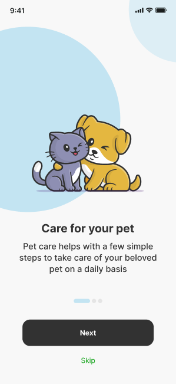
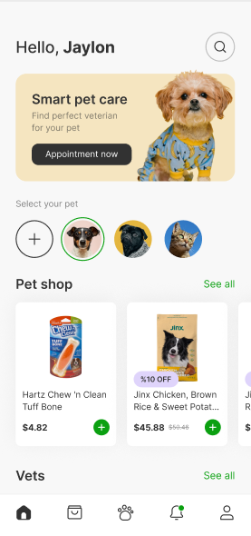
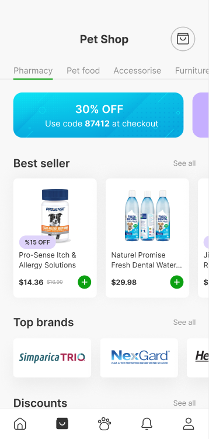
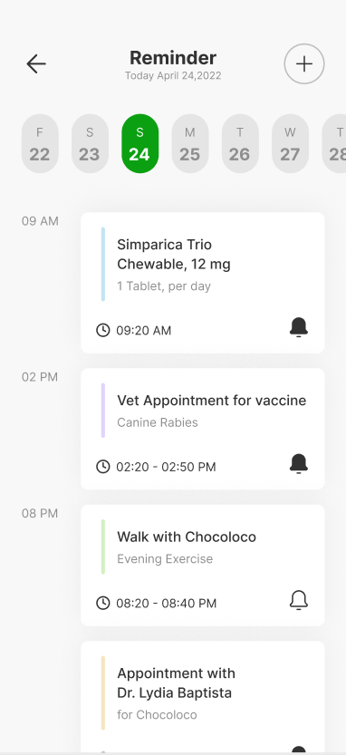
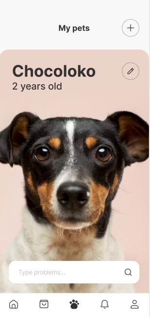

<div align="center">

# 🐾 Petito — Pet Care App

### A comprehensive Flutter application for modern pet owners


</div>

---

## 📱 About The Project

**Petito** is a cross-platform mobile application built with Flutter, designed to simplify and enhance the pet ownership experience. From finding the right veterinarian to managing medications and shopping for pet supplies — Petito brings everything together in one place.

> 🎓 This project was developed as a **Graduation Project**, where I led the full development lifecycle — from planning and UI/UX design to API integration and the first production release.

---

## ✨ Features

### 🔐 Authentication
- Phone number-based Sign Up & Sign In
- OTP verification
- Forgot password with SMS reset flow

### 🐶 Pet Management
- Add and manage multiple pet profiles
- Supports Dogs, Cats, Birds, and more
- Store pet details: name, species, breed, gender, age, and photo

### 👨‍⚕️ Veterinarian Module
- Browse 16+ available veterinarians
- Filter by Popular, Nearby, and Last Visited
- View detailed vet profiles with experience, ratings & reviews
- Book clinic or home visit appointments with calendar scheduling

### 💬 Online Consultation
- Real-time chat with veterinarians
- Session-based pricing (starting at $9.99)
- Describe symptoms and get expert advice instantly

### 🛒 Pet Shop
- Full e-commerce experience with categories:
  - 💊 Pharmacy
  - 🍖 Pet Food
  - 🎾 Accessories
  - 🛋️ Furniture
- Product details, discounts, and promotions
- Shopping cart and order placement
- Order tracking with delivery status

### ⏰ Reminders System
- Set reminders for:
  - 💊 Medicine
  - 💉 Vaccines
  - 🏃 Exercise
  - 💧 Liquids
- Custom name, time, duration, and amount per reminder
- Weekly calendar view for scheduled reminders

### 💳 Payment
- Multiple payment methods:
  - Credit / Debit Card
  - PayPal
  - Google Pay
  - Apple Pay
- Add, edit, and manage saved payment methods

### 📍 Location Services
- Map-based address selection
- Drag to choose precise location
- Save multiple addresses (Home, Work, Other)

### 🔔 Notifications
- Appointment reminders
- Order status updates
- Vaccine and medication alerts

### 📚 Articles
- Educational pet care content
- Tips for common pet health issues

---

## 🛠️ Tech Stack

| Layer | Technology |
|---|---|
| Framework | Flutter |
| Language | Dart |
| Backend | REST API |
| Design | Figma |
| Version Control | Git & GitHub |

---

## 📸 Screenshots

| Onboarding | Home | Vet Booking |
|---|---|---|
|  |  |  |

| Pet Shop | Reminders | Profile |
|---|---|---|
|  |  |  |

---

## 🚀 Getting Started

### Prerequisites

- Flutter SDK `>=3.0.0`
- Dart SDK `>=3.0.0`
- Android Studio or VS Code
- A connected device or emulator

### Installation

1. **Clone the repository**
   ```bash
   git clone https://github.com/YOUR-USERNAME/petito.git
   cd petito
   ```

2. **Install dependencies**
   ```bash
   flutter pub get
   ```

3. **Run the app**
   ```bash
   flutter run
   ```

---

## 📁 Project Structure

```
petito/
├── lib/
│   ├── core/
│   │   ├── api/
│   │   ├── theme/
│   │   └── utils/
│   ├── features/
│   │   ├── auth/
│   │   ├── pet/
│   │   ├── vet/
│   │   ├── shop/
│   │   ├── reminders/
│   │   └── profile/
│   └── main.dart
├── assets/
│   ├── images/
│   └── icons/
└── pubspec.yaml
```

---

## 🧩 Usage

If you want to access the resource manager:

```dart
# colors
ColorManager.primary;

# images
ImageAssets.splashLogoPng;
SVGAssets.homeSvg;
IconAssets.arrowRight;

# fontWeightManager
FontWeightManager.black;

# text Strings
AppString.bankWithdraw;
```

For navigation — the project is built based on `OnGenerateRoute`:

```dart
# pushNamed
sl<NavigationService>().navigateTo(Routes.home);

# pushNamedAndRemoveUntil
sl<NavigationService>().navigateToAndRemove(Routes.home);

# pop
sl<NavigationService>().pop();
```

---

## 👨‍💻 Author

**Abdalrhman Abuwarda**

[](https://github.com/YOUR-USERNAME)
[](https://linkedin.com/in/YOUR-PROFILE)

---

## 📄 License

This project is licensed under the MIT License — see the [LICENSE](LICENSE) file for details.